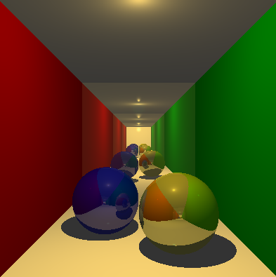
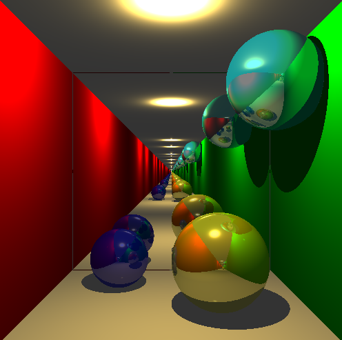
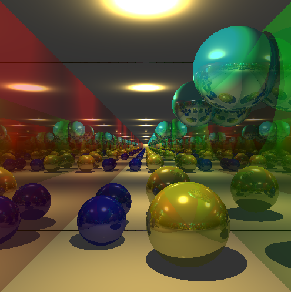
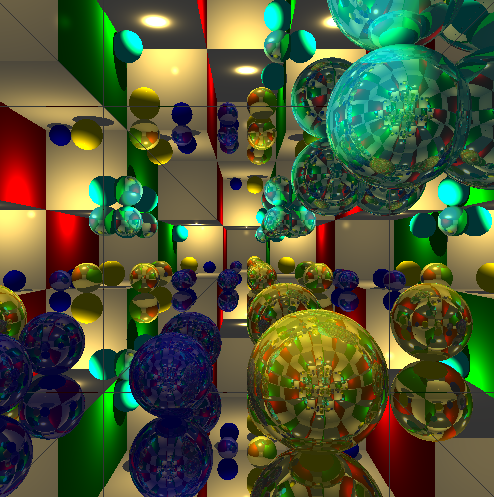
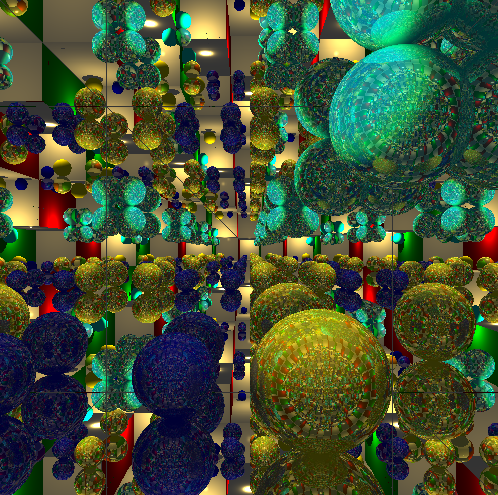

# Raytracer

A simple raytracer built on https://www.gabrielgambetta.com/computer-graphics-from-scratch/02-basic-raytracing.html. Also added coloured lighting and light falloff

**Examples:**

Simple example

Reflections 1D

Reflections 2D

Reflections 3D (5 bounces)

Reflections 3D (10 bounces)

**How to run:**

- Double click the html file
- Wait a few minutes for it to render
- Select a different template to see a different visulization
